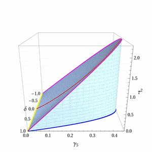

# SM-quadruplet

The Mathematica files with computation examples for the paper "On the addition of an SU(2) quadruplet of scalars to the Standard Model".

- The Mathematica notebook with examples for the model with hypercharge Y = 0 ["Quadruplet_Y0.nb"](https://github.com/jurciukonis/RGEs_for_multiplets/blob/main/Quadruplet_Y0.nb).

- The Mathematica notebook with examples for the model with hypercharge Y = 3/2 ["Quadruplet_Y32.nb"](https://github.com/jurciukonis/RGEs_for_multiplets/blob/main/Quadruplet_Y32.nb).

- The Mathematica notebook with examples for the model with hypercharge Y = 1/2 ["Quadruplet_Y12.nb"](https://github.com/jurciukonis/RGEs_for_multiplets/blob/main/Quadruplet_Y12.nb).

- The Mathematica notebook with examples for the model with hypercharge Y = 1/2 ["Quadruplet_Y12K.nb"](https://github.com/jurciukonis/RGEs_for_multiplets/blob/main/Quadruplet_Y12K.nb).

  

- For more information about the models and obtained results see refs. [[1](https://arxiv.org/abs/XXXX.XXXXX)] and [[2](https://arxiv.org/abs/2505.05272)].

**If you use files from the repository for a publication, please cite these references:**

[[1](https://arxiv.org/abs/XXXX.XXXXX)] D. Jurčiukonis and L. Lavoura, On the addition of an SU(2) quadruplet of scalars to the Standard Model, [arXiv:XXXX.XXXXX](https://arxiv.org/abs/XXXX.XXXXX).

[[2](https://arxiv.org/abs/2505.05272)] A. Milagre, D. Jurčiukonis and L. Lavoura, Vacuum stability conditions for new SU(2) multiplets, [arXiv:2404.07897](https://arxiv.org/abs/2505.05272).
